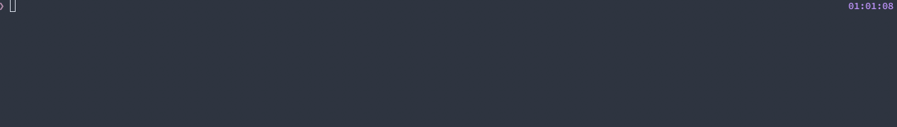

# Go Pro Merge

[](https://gitlab.com/gngeorgiev/gopro-merge/-/commits/master)

Merge Go Pro generated chaptered files into a single file

## Demo



#### Directory tree before:

```shell
❯ tree                                                                                                                                                00:41:57
.
└── raw
    ├── GH010307.MP4
    ├── GH010308.MP4
    ├── GH010309.MP4
    ├── GH010310.MP4
    ├── GH010314.MP4
    ├── GH010315.MP4
    ├── GH010316.MP4
    ├── GH010317.MP4
    ├── GH010318.MP4
    ├── GH020308.MP4
    ├── GH020314.MP4
    ├── GH020316.MP4
    ├── GH020317.MP4
    ├── GH030314.MP4
    ├── GH030316.MP4
    ├── GH030317.MP4
    ├── GH030318.MP4
    ├── GH040317.MP4
    ├── GH040318.MP4
    ├── GH050317.MP4
    ├── GH050318.MP4
    ├── GH060317.MP4
    ├── GH060318.MP4
    ├── GOPR0311.JPG
    ├── GOPR0312.JPG
    └── GOPR0313.JPG

1 directory, 26 files
```

#### Directory tree after:

```shell
❯ tree                                                                                                                                                00:42:02
.
├── GH000307.MP4
├── GH000308.MP4
├── GH000309.MP4
├── GH000310.MP4
├── GH000314.MP4
├── GH000315.MP4
├── GH000316.MP4
├── GH000317.MP4
├── GH000318.MP4
└── raw
    ├── GH010307.MP4
    ├── GH010308.MP4
    ├── GH010309.MP4
    ├── GH010310.MP4
    ├── GH010314.MP4
    ├── GH010315.MP4
    ├── GH010316.MP4
    ├── GH010317.MP4
    ├── GH010318.MP4
    ├── GH020308.MP4
    ├── GH020314.MP4
    ├── GH020316.MP4
    ├── GH020317.MP4
    ├── GH030314.MP4
    ├── GH030316.MP4
    ├── GH030317.MP4
    ├── GH030318.MP4
    ├── GH040317.MP4
    ├── GH040318.MP4
    ├── GH050317.MP4
    ├── GH050318.MP4
    ├── GH060317.MP4
    ├── GH060318.MP4
    ├── GOPR0311.JPG
    ├── GOPR0312.JPG
    └── GOPR0313.JPG

1 directory, 35 files
```

## Supported cameras and file formats

The tables have been built from the following [GoPro Camera File Naming Convention page](https://community.gopro.com/t5/en/GoPro-Camera-File-Naming-Convention/ta-p/390220#).

### HERO10 Black, HERO9 Black, HERO6 Black, & HERO7 (White, Silver, Black), HERO8 Black

| Recording type  | Example                           | Supported |
| --------------- | --------------------------------- | --------- |
| Single Video    | **GH**011234.mp4,**GX**011234.mp4 | ✅        |
| Chaptered Video | GH**01**1234.mp4,GH**02**1234.mp4 | ✅        |
| Looping Video   | GHAA**0001**.mp4,GHAA**0002**.mp4 | ✅        |

### Max 360

| Recording type | Example           | Supported |
| -------------- | ----------------- | --------- |
| Video          | GS**012345**.360  | ❌        |
| TimeWarp       | GS**012345**.360  | ❌        |
| Photo          | GS\_**1234**.jpeg | ❌        |
| PowerPano      | GP\_**1234**.jpeg | ❌        |

### Max HERO

| Recording type  | Example             | Supported |
| --------------- | ------------------- | --------- |
| Video           | GH**012345**.mp4    | ❌        |
| TimeWarp        | GH**012345**.mp4    | ❌        |
| Photo           | GS\_**1234**.jpeg   | ❌        |
| TimeLapse Video | GH**012345**.mp4    | ❌        |
| TimeLapse Photo | GPAA\_**1234**.jpeg | ❌        |

### Fusion

| Recording type  | Example                                                             | Supported |
| --------------- | ------------------------------------------------------------------- | --------- |
| Single Video    | GPFR**0001**.mp4                                                    | ❌        |
| Chaptered Video | GP**FR0002**.mp4,GF**010002**.mp4,GP**BK0002**.mp4,GB**010002**.mp4 | ❌        |
| Single Photo    | GPFR**0003**.mp4,GPBK**0004**.mp4                                   | ❌        |

### HD HERO2, HERO3, HERO3+, HERO (2014), HERO Session, HERO4, HERO5 Black, HERO5 Session, HERO (2018)

| Recording type                         | Example                                                                  | Supported |
| -------------------------------------- | ------------------------------------------------------------------------ | --------- |
| Single Video                           | GOPR**1234**.mp4                                                         | ❌        |
| Chaptered Video                        | GOPR**1234**.mp4,GP**011234**.mp4,GP**021234**.mp4                       | ❌        |
| Single Photo                           | GOPR**0002**.jpg                                                         | ❌        |
| Burst, Time-Lapse Photo, Looping Video | G0**231111**.jpg – G0**231120**.jpg, G0**241121**.jpg – G0**241221**.jpg | ❌        |
| 3D Recording                           | 3D_L**0002**.mp4,3D_R**0002**.mp4,3D_L**1234**.jpg,3D_R**1234**.jpg      | ❌        |

## Usage

```shell
❯ gopro-merge --help                                                                                                                                  01:02:58
gopro-merge 0.1.0

USAGE:
    gopro-merge [OPTIONS] [ARGS]

FLAGS:
    -h, --help       Prints help information
    -V, --version    Prints version information

OPTIONS:
    -p, --parallel <parallel>    The amount of parallel movies to be merged. [default: amount of cores]
    -r, --reporter <reporter>    The reporter to be used for progress one of "json" | "progressbar" [default:
                                 progressbar]

ARGS:
    <input>     Directory where to read movies from. [default: current directory]
    <output>    Directory where to write merged movies. [default: <input>]
```

## Debugging

Set `RUST_LOG=debug` and follow the logs as well as ffmpeg stderr output log files:

```shell
[2021-11-14T23:15:25Z DEBUG gopro_merge::merge::ffmpeg::merger] setting progress len for GH000307.MP4 to 0 seconds
[2021-11-14T23:15:25Z DEBUG gopro_merge::merge::ffmpeg::command] Creating ffmpeg command with args ["-f", "concat", "-safe", "0", "-y", "-i", "/var/folders/11/7dvgz63d6rd047j_7vc854400000gn/T/.0307.txt", "-c", "copy", "/<FULL_PATH>/GH000307.MP4", "-loglevel", "error", "-progress", "pipe:1"]
[2021-11-14T23:15:25Z INFO  gopro_merge::merge::ffmpeg::command] creating ffmpeg stderr file at /var/folders/11/7dvgz63d6rd047j_7vc854400000gn/T/.ffmpeg_stderr_GH000307.MP4.log
[2021-11-14T23:15:25Z DEBUG gopro_merge::merge::ffmpeg::merger] updating progress for GH000307.MP4 to 0 seconds
```

## Installation

No prebuilt binaries are available. Install `cargo` and then install this repo with `cargo install`:

1. [https://www.rust-lang.org/tools/install](https://www.rust-lang.org/tools/install)
1. `cargo install --git https://gitlab.com/gngeorgiev/gopro-merge`
1. Install `ffmpeg`, it should also include `ffprobe`. Both binaries should be in your `$PATH`

## License

[MIT](LICENSE)
